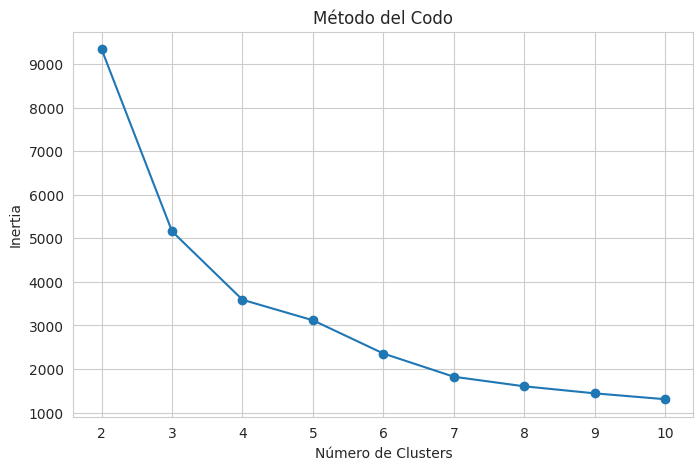
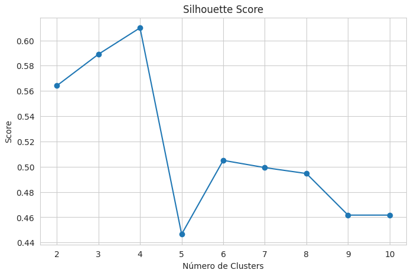
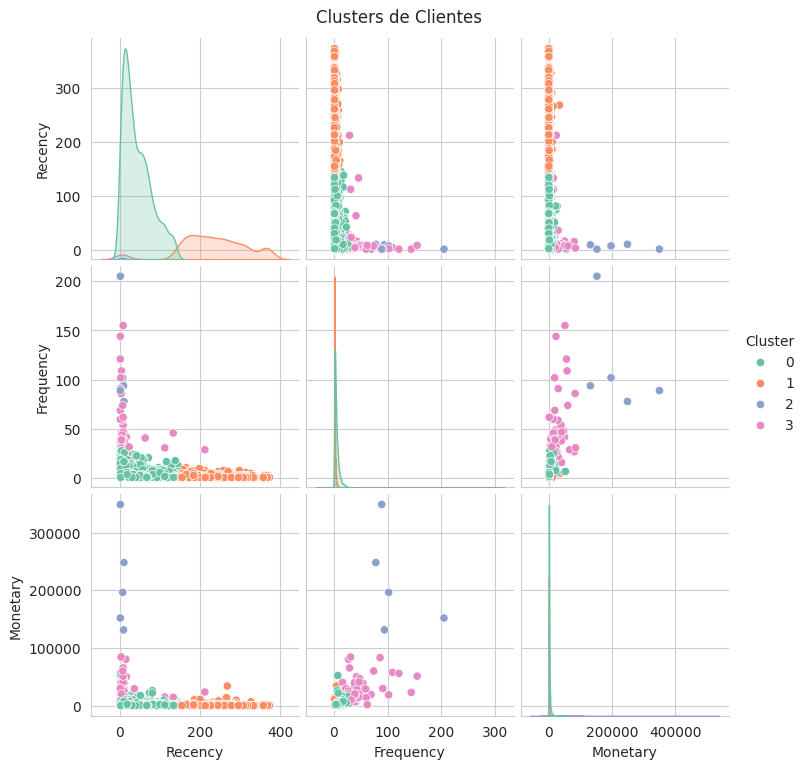

# Customer Segmentation using K-Means Clustering

Academic team project developed at CETYS University.

Machine learning project developed in Google Colab for customer segmentation using RFM analysis and K-Means clustering.

## Description

This project applies unsupervised machine learning to analyze customer purchasing behavior from an online retail dataset.

Customers are grouped based on Recency, Frequency and Monetary value, allowing the identification of different customer segments for business analysis and marketing decision-making.

## Team

| Name | GitHub |
|------|--------|
| Jacobo Rodriguez | jacoborodriguez17 |
| Jesus Olivas Martinez | JesusOliv4s |
| Valeria Guitron Ortega | valeria-guitron |

## Technologies Used

- Python
- Pandas
- NumPy
- Matplotlib
- Seaborn
- Scikit-learn
- Google Colab

## Workflow

Online Retail Dataset  
→ Data Cleaning  
→ Exploratory Data Analysis  
→ Feature Engineering  
→ RFM Analysis  
→ Feature Scaling  
→ K-Means Clustering  
→ Customer Segment Analysis

## Main Features

- Cleaned and prepared customer transaction data
- Removed invalid, cancelled and incomplete records
- Created customer-level RFM features
- Scaled numerical variables for clustering
- Evaluated cluster quality using clustering metrics
- Applied K-Means to group customers by purchasing behavior
- Interpreted customer segments from a business perspective

## Dataset

The project uses an online retail transactional dataset with customer purchase information.

Expected dataset file: `online_retail_II.xlsx`

The dataset is not included in this repository. To run the notebook, upload the dataset in Google Colab or update the file path inside the notebook.

## How to Run

1. Open `customer_segmentation_clustering.ipynb` in Google Colab or Jupyter Notebook.
2. Upload the dataset file.
3. Update the dataset path if needed.
4. Run all cells from top to bottom.

## Requirements

- numpy
- pandas
- matplotlib
- seaborn
- scikit-learn
- openpyxl
- jupyter

## Results

The model segments customers into different groups based on their RFM behavior.

These segments can help identify high-value customers, frequent buyers, low-engagement customers and customers who may need retention strategies.

## Visual Results

### Elbow Method

### Silhouette Score

### Cluster Analysis

## Conclusion

This project demonstrates how unsupervised learning can transform raw transaction data into meaningful customer segments.

By combining RFM analysis with K-Means clustering, the project provides a practical approach for understanding customer behavior and supporting data-driven business decisions.
